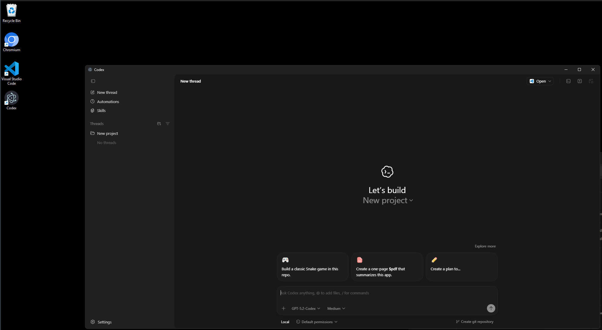

# Get Codex - Codex for Desktop

Bring Codex to **Intel Mac** and **Windows** with a simple CLI workflow for build, download, and packaging. 🚀

[](https://github.com/0x0a0d/get-codex)
[](https://github.com/0x0a0d/get-codex)
[](./LICENSE)
[](https://github.com/0x0a0d/get-codex)



## Introduction

**Get Codex** is a desktop-focused toolchain that helps users on platforms often left behind by official releases:

- macOS Intel (`.dmg`)
- Windows x64 / arm64 (`.zip`)

It automates artifact resolution, local build flow, and optional signing steps.

## Features

- ⚡ Build mode for Intel Mac and Windows targets
- 📦 Cache/download mode for latest release artifacts
- 🪟 Windows ZIP output (x64, arm64)
- 🍎 macOS Intel DMG output
- 🔐 Optional signing flow for macOS artifacts
- 🧩 Simple CLI flags for platform, arch, format, and workdir

## Tech Stack

- **Runtime:** Node.js
- **Language:** JavaScript (CommonJS)
- **Testing:** Node.js built-in test runner (`node --test`)
- **Packaging Scripts:** Custom Node scripts for macOS/Windows build artifacts

## Installation

### Option 1: Run directly with NPX

```bash
npx get-codex --help
```

### Option 2: Clone and run locally

```bash
git clone https://github.com/0x0a0d/get-codex.git
cd get-codex
npm install
npm test
```

## Usage

### Show help

```bash
npx get-codex --help
```

### Build mode (default)

```bash
npx get-codex
```

```bash
npx get-codex --build --workdir /absolute/path/to/workdir
```

### Build for Windows arm64 ZIP

```bash
npx get-codex --build --platform windows --arch arm64 --format zip --workdir /absolute/path/to/workdir
```

### Cache/download mode

```bash
npx get-codex --cache --platform windows --arch x64 --format zip
```

### Sign mode

```bash
npx get-codex --sign /Applications/Codex.app
```

## Contributing

Contributions are welcome! 🙌

```bash
git checkout -b feat/your-feature
npm test
git commit -m "feat: add your feature"
git push origin feat/your-feature
```

Then open a Pull Request.

## License

Licensed under the **ISC** License.
